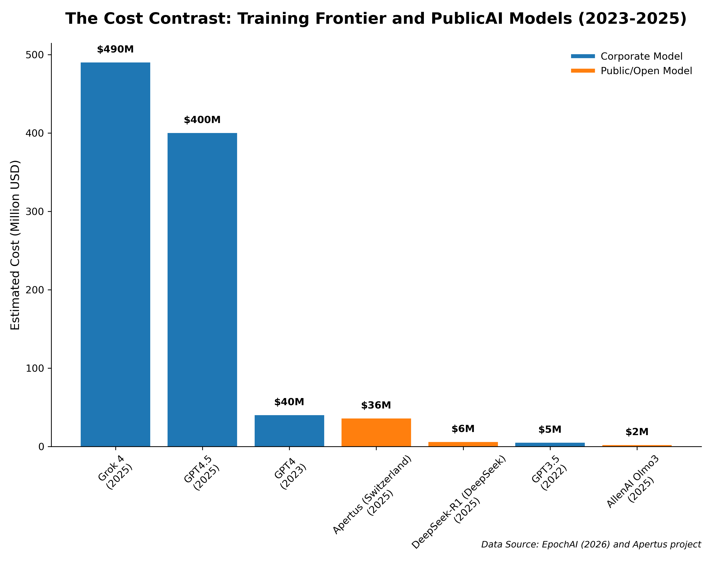
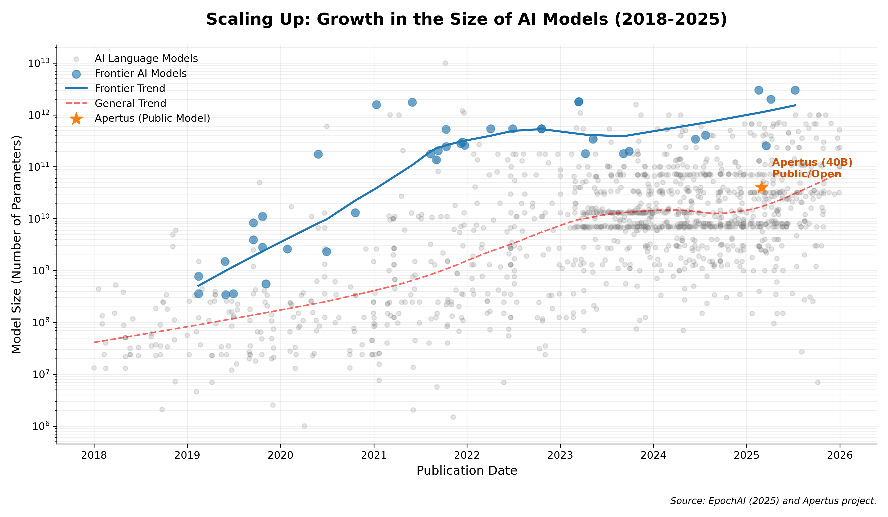
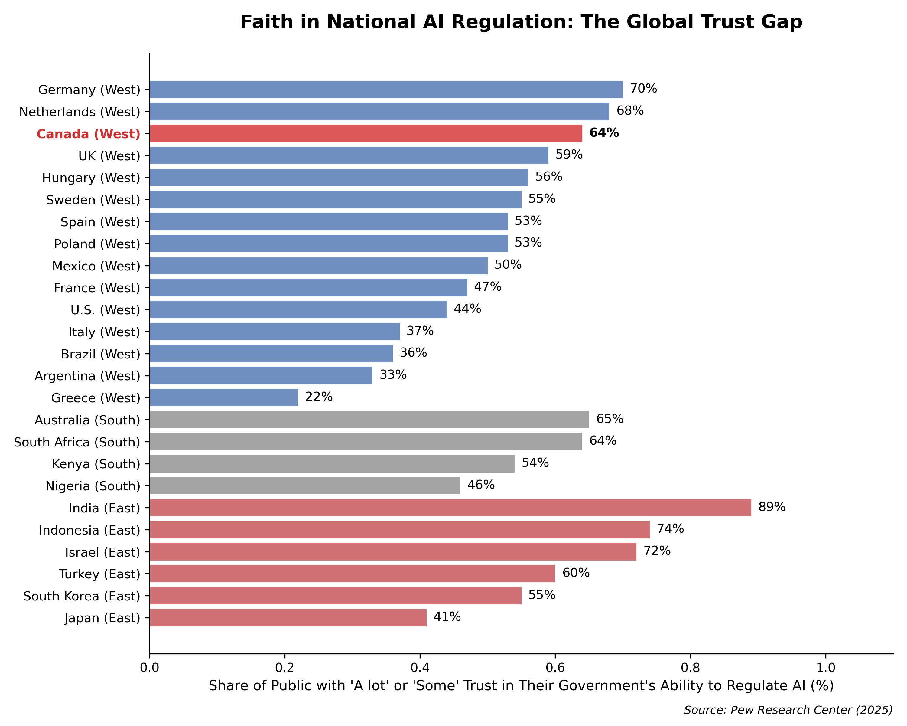
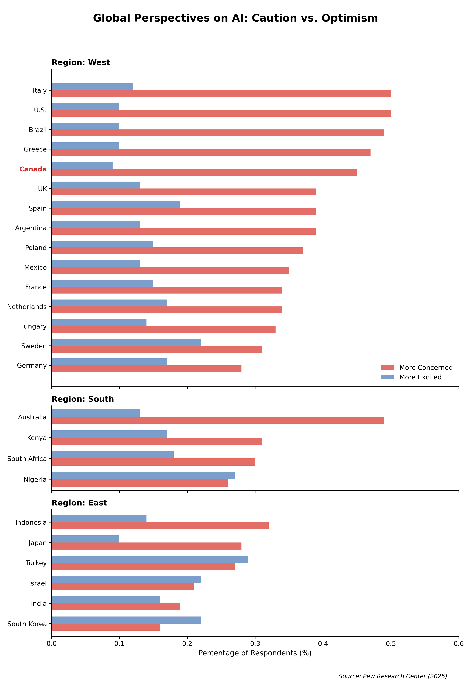
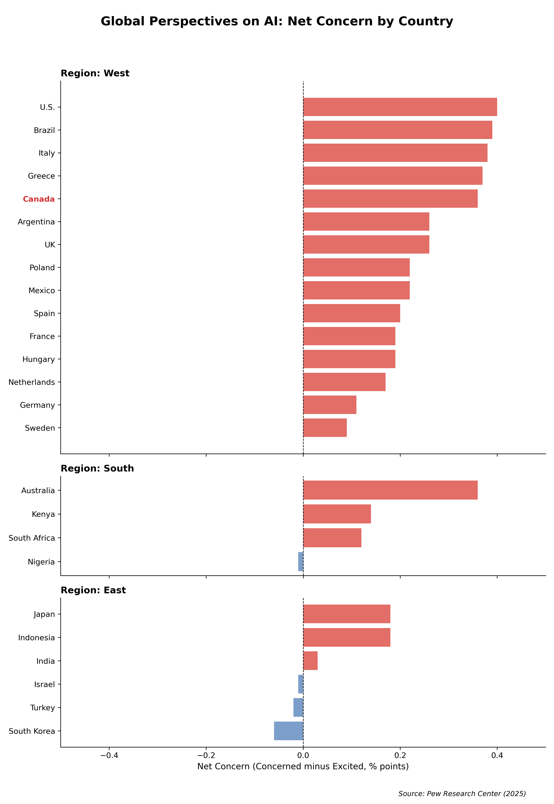

# Canada AI Model Figures

Data and scripts for generating figures for a Canadian newspaper feature on the potential for development of Canadian Public AI models.

## Quick Start
```bash
conda env create -f environment.yml
conda activate canada-ai_figures
python charts.py
```

## Data Sources
- **Epoch AI (2025/2026)**: Model parameters, training compute, and cost estimates.
- **Pew Research (2025)**: International surveys on AI trust and optimism.
- **Apertus Project**: Data on public/national AI development initiatives.

## Generated Figures

### Model Development Costs


### AI Model Growth Trends


### Public Trust in AI Regulation


### Global Perspectives on AI


### Sentiment Gap


*NOTE:* This code generated with AI assistance (Gemini 3 Flash).